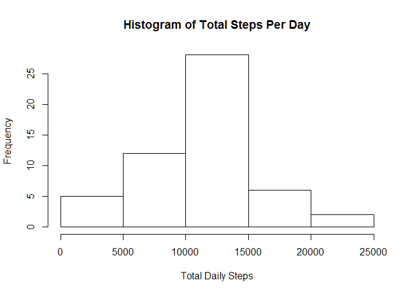
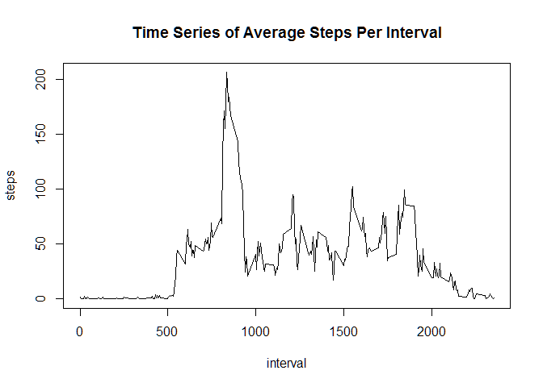
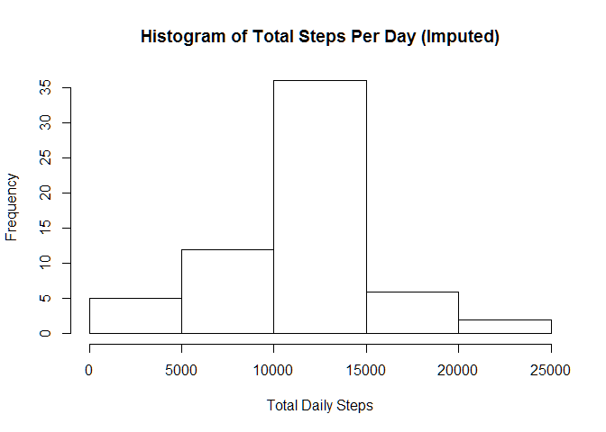
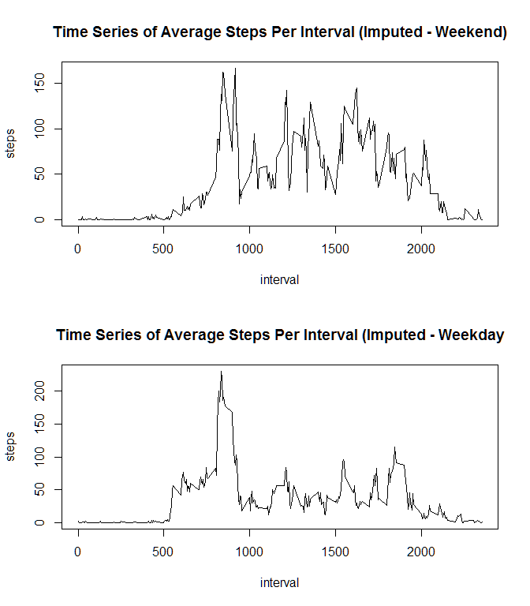

# Reproducible Research: Peer Assessment 1


This document is a submission for the first Peer Assessment in the Reproducible Data course on Coursera.

### Loading and preprocessing the data

First we must load the libraries to be used throughout the document. Note that messages and warnings on the library loads are suppressed.


```r
library(data.table)
library(lubridate)
```

Now read in and transform the data:


```r
stepData <- fread('unzip -cq activity.zip')
stepData$date <- ymd(stepData$date)
```

### What is mean total number of steps taken per day?

For this part of the assignment, you can ignore the missing values in
the dataset.

1. Make a histogram of the total number of steps taken each day

```r
stepDailyTotal <- aggregate(steps ~ date, data = stepData, sum)
hist(stepDailyTotal$steps, 
     main = "Histogram of Total Steps Per Day", 
     xlab = "Total Daily Steps")
```

<!-- -->

2. Calculate and report the **mean** and **median** total number of steps taken per day

```r
summary(stepDailyTotal$steps)
```

```
##    Min. 1st Qu.  Median    Mean 3rd Qu.    Max. 
##      41    8841   10760   10770   13290   21190
```

### What is the average daily activity pattern?

1. Make a time series plot (i.e. `type = "l"`) of the 5-minute interval (x-axis) and the average number of steps taken, averaged across all days (y-axis)


```r
stepIntervalMean <- aggregate(steps ~ interval, data = stepData, mean)
with(stepIntervalMean,plot(x = interval, 
                           y = steps, 
                           type = "l", 
                           main = "Time Series of Average Steps Per Interval"))
```

<!-- -->

2. Which 5-minute interval, on average across all the days in the dataset, contains the maximum number of steps?


```r
stepIntervalMean[which.max(stepIntervalMean$steps),1]
```

```
## [1] 835
```
### Imputing missing values

Note that there are a number of days/intervals where there are missing values (coded as `NA`). The presence of missing days may introduce bias into some calculations or summaries of the data.

1. Calculate and report the total number of missing values in the dataset (i.e. the total number of rows with `NA`s)


```r
sum(is.na(stepData))
```

```
## [1] 2304
```

2. Devise a strategy for filling in all of the missing values in the dataset. The strategy does not need to be sophisticated. For example, you could use the mean/median for that day, or the mean for that 5-minute interval, etc.

**For step intervals with NA steps, the average steps for that interval will be used.**

3. Create a new dataset that is equal to the original dataset but with the missing data filled in.


```r
stepDataImputed <- merge(stepData, stepIntervalMean, by = "interval")
names(stepDataImputed) <- c("interval", "steps", "date", "mean.steps")
stepDataImputed$steps <- as.numeric(stepDataImputed$steps)
stepDataImputed[is.na(stepDataImputed$steps),"steps"] <- stepDataImputed[is.na(stepDataImputed$steps),"mean.steps"] 
```

4. Make a histogram of the total number of steps taken each day and Calculate and report the **mean** and **median** total number of steps taken per day. Do these values differ from the estimates from the first part of the assignment? What is the impact of imputing missing data on the estimates of the total daily number of steps?


```r
stepDailyTotalImputed <- aggregate(steps ~ date, data = stepDataImputed, sum)
hist(stepDailyTotalImputed$steps, 
     main = "Histogram of Total Steps Per Day (Imputed)", 
     xlab = "Total Daily Steps")
```

<!-- -->

```r
summary(stepDailyTotalImputed$steps)
```

```
##    Min. 1st Qu.  Median    Mean 3rd Qu.    Max. 
##      41    9819   10770   10770   12810   21190
```

**Mean does not change but median shifts slightly. No major impact; just slightly increases the frequency of average-step days.**

### Are there differences in activity patterns between weekdays and weekends?

For this part the `weekdays()` function may be of some help here. Use the dataset with the filled-in missing values for this part.

1. Create a new factor variable in the dataset with two levels -- "weekday" and "weekend" indicating whether a given date is a weekday or weekend day.


```r
stepDataImputed$day.type <- as.factor(ifelse(wday(stepDataImputed$date) %in% c(1,7),"weekend", "weekday"))
```

2. Make a panel plot containing a time series plot (i.e. `type = "l"`) of the 5-minute interval (x-axis) and the average number of steps taken, averaged across all weekday days or weekend days (y-axis).


```r
weekend <- stepDataImputed[stepDataImputed$day.type == "weekend", ]
weekday <- stepDataImputed[stepDataImputed$day.type == "weekday", ]

stepIntervalMeanImpWeekend <- aggregate(steps ~ interval, data = weekend, mean)
stepIntervalMeanImpWeekday <- aggregate(steps ~ interval, data = weekday, mean)

par(mfrow=c(2,1))
with(stepIntervalMeanImpWeekend, plot(x = interval, 
                            y = steps, 
                            type = "l", 
                            main = "Time Series of Average Steps Per Interval (Imputed - Weekend)"))
with(stepIntervalMeanImpWeekday, plot(x = interval, 
                            y = steps, 
                            type = "l", 
                            main = "Time Series of Average Steps Per Interval (Imputed - Weekday"))
```

<!-- -->
